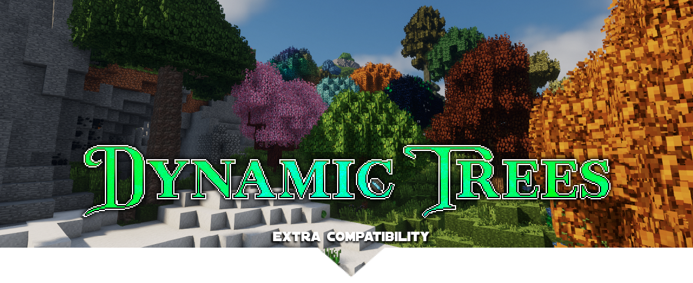

# Dynamic Trees Extra Compatibility
This repository holds many Dynamic Trees compatibility projects, including addons for Natura, The Twilight Forest, The Betweenlands, and Forestry.

## Mod Requests
For information on how to request a dynamic trees compat mod to be made, see [this post](https://github.com/supermassimo/DynamicTrees-ExC/issues/41). 

## Discord 
[Join](https://discord.gg/83qcpkY) the official Dynamic Trees Discord to chat about Dynamic Trees, its addons, among anything else.

 
